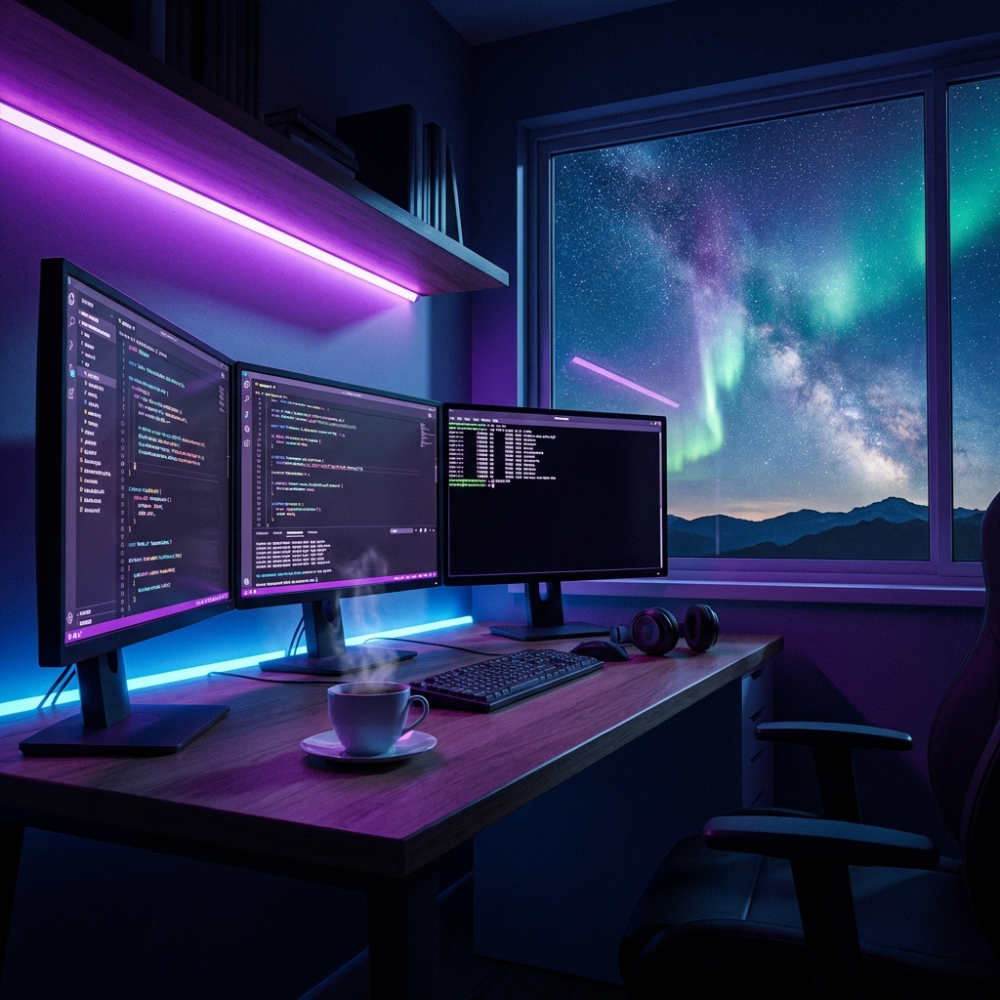

<![CDATA[<!-- Header Image -->

  

<!-- Animated Greeting -->

  

<!-- Profile Badges -->

  
  

---

<!-- About Section -->
##  About Me

🎓 **Computer Science Undergraduate** passionate about creating elegant solutions

💻 Currently exploring **Full-Stack Development** & **Cloud Technologies**

🚀 Always learning and building innovative projects

🌱 Open to **Internships**, **Collaborations** & **Freelance Opportunities**

📫 Reach me at **eshandineth@gmail.com**

⚡ Fun fact: *I debug with console.log and I'm proud of it!*

 

---

<!-- Tech Stack Section -->
## 🛠️ Tech Stack

  

  

  

---

<!-- GitHub Stats Section -->
## 📊 GitHub Stats

  
  

  

<!-- Activity Graph -->

  

---

<!-- Trophies Section -->
## 🏆 GitHub Trophies

  

---

<!-- Connect Section -->
## 🤝 Connect With Me

  
  
  
  

---

<!-- Footer -->

  

  

<h3 align="center">💜 Thanks for visiting! Let's build something amazing together! 💜</h3>
]]>
