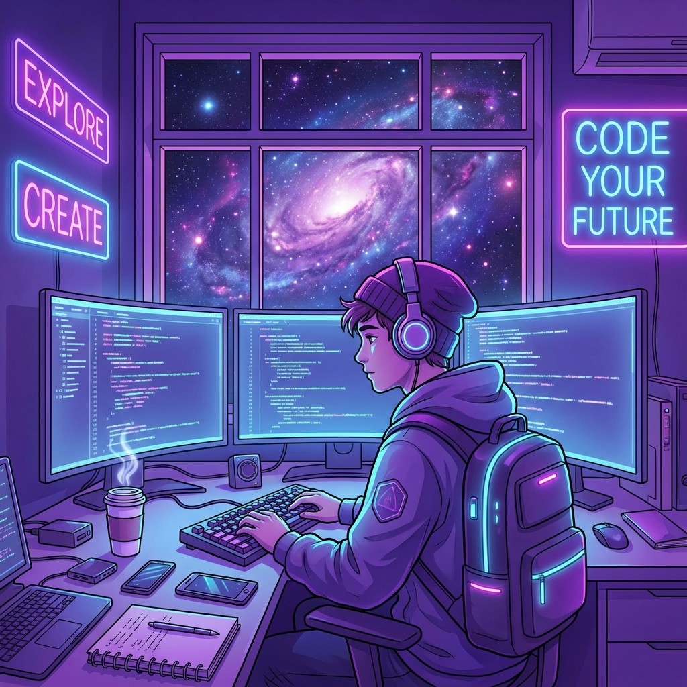

<![CDATA[<!-- Header Banner -->
<p align="center">
  
</p>

<!-- Animated Title -->
<h1 align="center">
  <a href="https://git.io/typing-svg">
    
  </a>
</h1>

<!-- Animated Wave and Profile Views -->
<p align="center">
  
  <a href="https://github.com/eshandineth?tab=followers">
    
  </a>
</p>

<!-- Social Badges -->
<p align="center">
  <a href="https://github.com/eshandineth">
    
  </a>
  <a href="https://linkedin.com/in/eshandineth">
    
  </a>
  <a href="mailto:eshandineth@gmail.com">
    
  </a>
</p>

---

<!-- About Me Section -->
##  About Me


```yaml
name: Eshan Dineth
located_in: Sri Lanka 🇱🇰
current_role: University Student
education:
  - 🎓 Studying Computer Science
  - 📚 Always learning new technologies
  
interests:
  - 🚀 Exploring new technologies
  - 💻 Building cool projects
  - 🌐 Web Development
  - 🤖 AI & Machine Learning
  
hobbies:
  - ☕ Coffee & Code nights
  - 🎮 Gaming
  - 📖 Reading tech blogs
  
currently_learning:
  - Full Stack Development
  - Cloud Technologies
  - Open Source Contribution
  
fun_fact: "I debug with console.log and I'm not ashamed 😄"
```

---

<!-- Tech Stack Section -->
## 🛠️ Tech Stack & Tools

<p align="center">
  
</p>

<!-- Detailed badges -->
<details>
<summary>📌 Click to expand full tech stack</summary>
<br>

**💻 Languages**


**🚀 Frameworks & Libraries**


**🗄️ Databases & Cloud**


**🔧 Tools & Platforms**


</details>

---

<!-- GitHub Stats Section -->
## 📊 GitHub Stats

<p align="center">
  <a href="https://github.com/eshandineth">
    
  </a>
  <a href="https://github.com/eshandineth">
    
  </a>
</p>

<!-- Streak Stats -->
<p align="center">
  <a href="https://github.com/eshandineth">
    
  </a>
</p>

<!-- Activity Graph -->
<p align="center">
  <a href="https://github.com/eshandineth">
    
  </a>
</p>

---

<!-- Contribution Snake Animation -->
## 🐍 Watch My Contributions Get Eaten!

<p align="center">
  
</p>

---

<!-- Spotify Now Playing (Optional - needs setup) -->
## 🎧 Vibing To

<p align="center">
  <a href="https://open.spotify.com/user/eshandineth">
    
  </a>
</p>

---

<!-- Random Dev Quote -->
## 💭 Random Dev Quote

<p align="center">
  
</p>

---

<!-- Trophy Section -->
## 🏆 GitHub Trophies

<p align="center">
  
</p>

---

<!-- Footer -->
<p align="center">
  
</p>

<h3 align="center">
   
  <em>Let's connect and build something amazing together!</em>
</h3>

<p align="center">
  
  
</p>

<!-- Secret Easter Egg -->
<!--
    ╔══════════════════════════════════════════════════════════════════════╗
    ║                                                                      ║
    ║   🎉 You found the secret! Thanks for checking out my profile!       ║
    ║   Here's a virtual high-five! ✋                                      ║
    ║                                                                      ║
    ╚══════════════════════════════════════════════════════════════════════╝
-->
]]>
